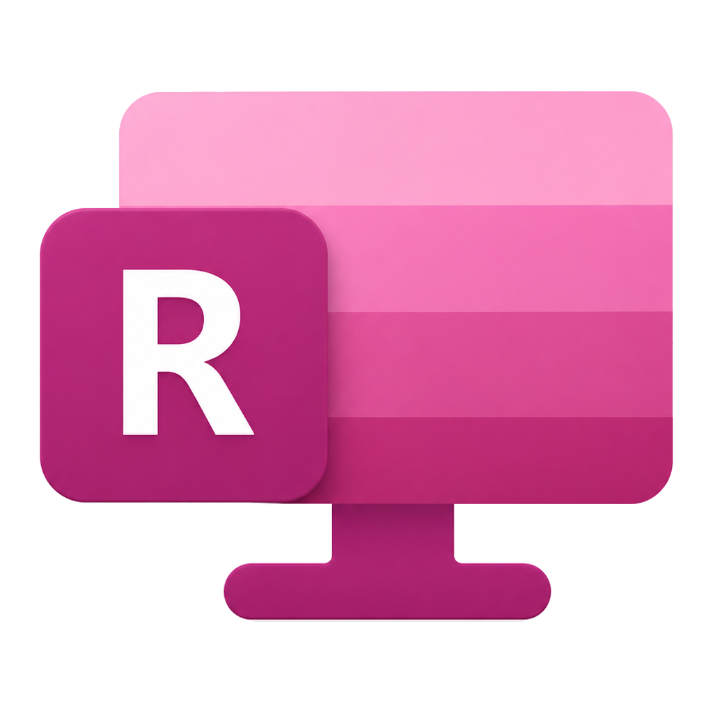
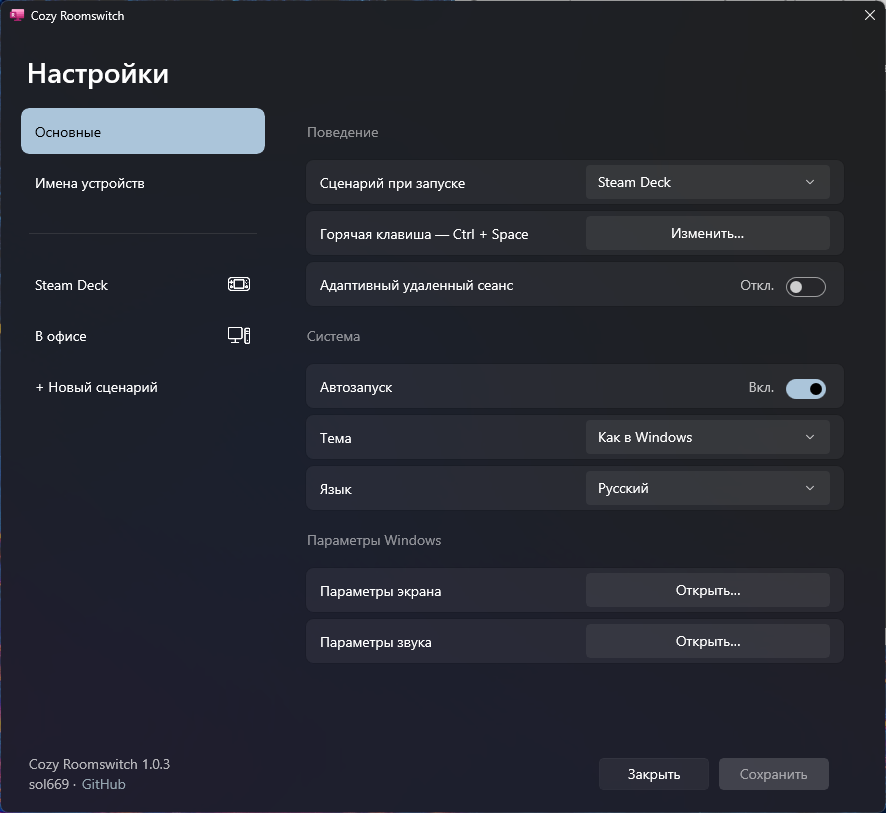
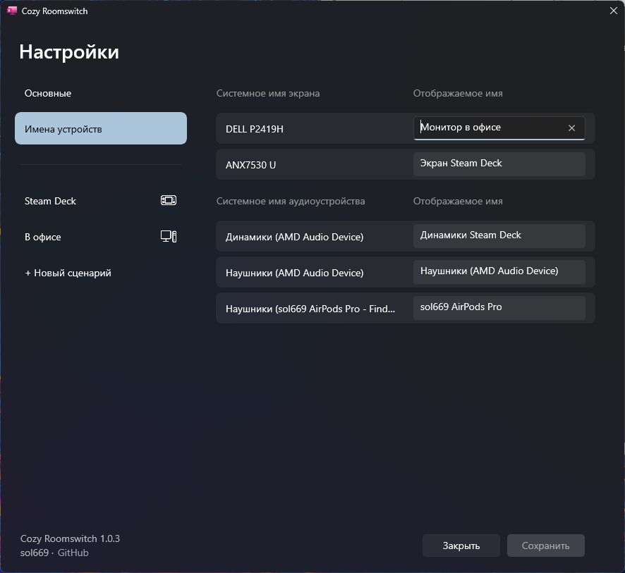
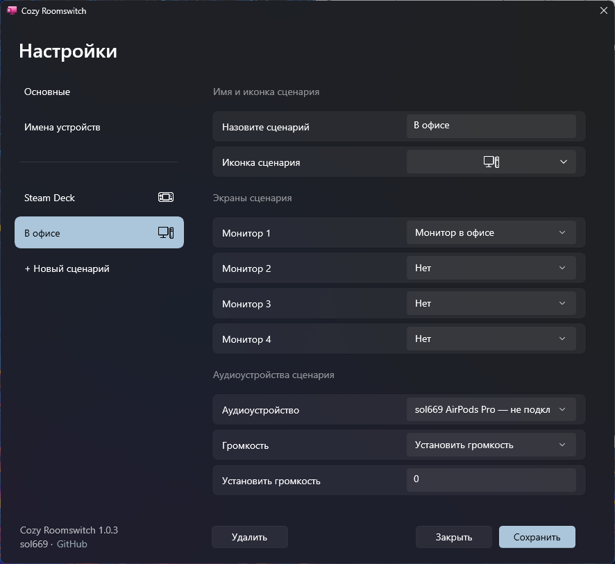
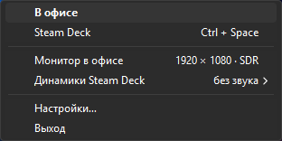

# Cozy Roomswitch

[Русский](#русский) · [English](#english)

---

## Русский

**Cozy Roomswitch** — лёгкая утилита для Windows 10/11, которая переключает готовые сценарии рабочего места одним нажатием в системном трее или горячей клавишей.

Сценарий объединяет подключённые экраны, аудиоустройство и, при необходимости, стартовую громкость. Например: «Кабинет» с двумя мониторами и аудиокартой, «Гостиная» с телевизором или отдельный сценарий для ноутбука.

### Возможности

- До четырёх экранов в одном сценарии.
- Выбор аудиоустройства и необязательная установка громкости при переключении.
- Пользовательские имена экранов и аудиоустройств.
- Палитра из 16 иконок и вариант с собственными литерами.
- Быстрое переключение через меню в трее или `Ctrl + Space`.
- Автозапуск и выбор сценария при входе в Windows.
- Светлая, тёмная или системная тема; русский и английский языки.
- Отдельный безопасный режим для удалённого сеанса RDP.

### Скриншоты

### Умное поведение при отключённых устройствах

Cozy Roomswitch не считает звук препятствием для переключения сценария: если аудиоустройство временно отсутствует, доступная конфигурация экранов всё равно применяется.

При этом утилита не подменяет отключённый аудиовыход случайным другим устройством Windows. В меню трея остаётся видно, что именно из сценария сейчас не подключено.

### Скачать

Стабильная версия Cozy Roomswitch — 1.0.0.

Для большинства пользователей рекомендуется:

- `Cozy-Roomswitch-Setup-Offline-v1.0.0.exe` — установщик со всеми необходимыми компонентами; подходит для установки без интернета.

Также доступны:

- `Cozy-Roomswitch-Setup-v1.0.0.exe` — компактный установщик; при необходимости скачает официальные Microsoft .NET 8 и Windows App Runtime.
- `Cozy-Roomswitch-Portable-Offline-v1.0.0-win-x64.zip` — portable-версия с официальными установщиками компонентов в папке `Prerequisites`.
- `Cozy-Roomswitch-Portable-v1.0.0-win-x64.zip` — компактная portable-версия; требует установленный .NET 8 и Windows App Runtime 2.3.

Перед обновлением завершите Cozy Roomswitch через пункт «Выход» в меню трея. Настройки хранятся в папке Data рядом с программой и удаляются вместе с ней.

### Что Cozy Roomswitch не меняет

Утилита не управляет расположением экранов, разрешением, масштабом, ориентацией и частотой обновления — за это по-прежнему отвечают параметры Windows.

### Требования

- Windows 10 версии 1809 или новее;
- 64-битная система;
- Для компактных версий: Microsoft .NET 8 Runtime и Windows App Runtime 2.3.

---

## English

**Cozy Roomswitch** is a lightweight Windows 10/11 utility for switching complete workspace scenarios from the system tray or with a hotkey.

A scenario combines connected displays, an audio output, and optionally a startup volume level. For example: an “Office” setup with two monitors and an audio interface, a “Living room” setup with a TV, or a laptop-only scenario.

### Features

- Up to four displays per scenario.
- Audio-output selection and optional volume setting when a scenario is applied.
- Custom names for displays and audio devices.
- A palette of 16 icons, plus a custom initials option.
- Fast switching from the tray menu or with `Ctrl + Space`.
- Windows startup support and a configurable startup scenario.
- Light, dark, or system theme; Russian and English UI.
- A separate safe mode for Remote Desktop sessions.

### Safe behaviour when hardware changes

Cozy Roomswitch does not treat a missing audio device as a reason to block an otherwise available display scenario.

At the same time, it never silently replaces an unavailable audio output with an unrelated Windows device. The tray menu clearly shows which device from the selected scenario is currently disconnected.

### Download

Cozy Roomswitch 1.0.0 is the stable release.

Recommended for most users:

- `Cozy-Roomswitch-Setup-Offline-v1.0.0.exe` — installer with all required components included; suitable for offline installation.

Other options:

- `Cozy-Roomswitch-Setup-v1.0.0.exe` — compact installer; downloads official Microsoft .NET 8 and Windows App Runtime if needed.
- `Cozy-Roomswitch-Portable-Offline-v1.0.0-win-x64.zip` — portable build with the official runtime installers in the `Prerequisites` folder.
- `Cozy-Roomswitch-Portable-v1.0.0-win-x64.zip` — compact portable build; requires .NET 8 and Windows App Runtime 2.3.

Before updating, exit Cozy Roomswitch from the tray menu. Settings live in the Data folder beside the app and are removed with it.

### What Cozy Roomswitch does not control

Cozy Roomswitch does not change display layout, resolution, scaling, orientation, or refresh rate. Those settings remain under Windows control.

### Requirements

- Windows 10 version 1809 or later;
- 64-bit system;
- Microsoft .NET 8 Runtime and Windows App Runtime 2.3 for compact builds.
